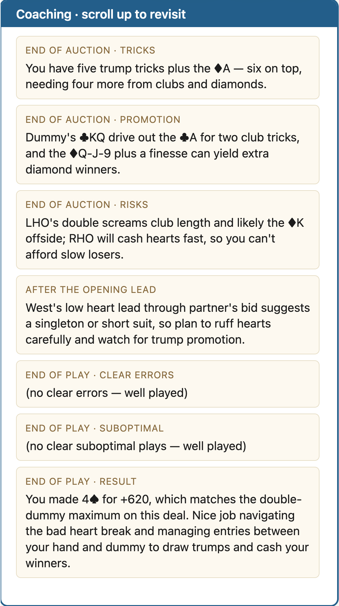

# Bridge Play Trainer

A self-paced web tool for practicing the **play** of bridge hands — declarer technique, defense, signaling, hand inference. The trainer uses the same scenario library as Practice-Bidding-Scenarios (`Bidding Scenarios/` folder) and adds an interactive play surface backed by [endplay](https://github.com/dominicprice/endplay) for legality checking and double-dummy resolution.

## Who it's for

There are lots of sites focused on bridge bidding. **This site is for those wanting to Play their Cards Better.** The UI is plain, large, and forgiving — large fonts, no timed animations, gentle errors, generous click targets. Claude grading and coaching are **off by default** so a new user gets a working trainer without any setup.

## How to run

```bash
cd Practice-Bidding-Scenarios
python3 -m uvicorn bridge-play-trainer.server:app --reload --port 8765
```

Open <http://localhost:8765> in any modern browser.

## How to use

1. **Pick a scenario** from the left sidebar. Sections collapse, a sticky search box filters. Scenarios are parsed live from `btn/-button-layout-release.txt`.
2. **Pick a role**: Declarer, Defender (West), or Defender (East). The server rejects a defender role that doesn't fit the board (e.g., asking for Defender-West when West is declarer); a future polish item replaces the alert with an inline error.
3. **Auction renders** in the center with a Play button. No timed animation — the user clicks Play when ready.
4. **Click cards in your hand** to play. Legal cards get a blue outline; illegal stay full-color but unbordered.
5. After each trick, a 3-second yellow freeze shows "Trick #N — X won". Click the center any time to peek at the last completed trick.
6. **Trick-counter strip** below the table: overlapping card-backs, green vertical = our side won the trick, red horizontal = opponents won.
7. **Controls below the table**:
   - **Next deal** — same scenario, next board.
   - **Undo** — pop the last card. Implemented by replaying the move-log up to the previous count, because endplay's `unplay()` errors across trick boundaries.
   - **Review** — press-and-hold to show the auction (uses pointer capture so the auction stays up if your finger drifts off-button).
   - **Replay** — reset to opening-lead state.
   - **Claim** — DDS plays out the remaining tricks; the result panel shows the four hands.
8. **Result panel** appears when the deal completes (all 13 tricks played or claimed). Shows the contract, made/down, and all four hands.

## Bridge table layout

The board is rotated so the **user always sits at the bottom (South in the rotated frame)**. Partner top, LHO left, RHO right. Auction calls, the contract banner, declarer/dummy/leader labels, hands, trick history, and trick totals all relabel together. This keeps the visual frame stable regardless of which seat the actual scenario dealt.

## Claude grading & coaching (optional)

Two modes, configured in the settings modal (gear icon):

### Testing mode (default)

After a trigger (every trick / from trick 4 / manual), the inference panel opens and asks for the student's read on the hidden hands:
- **Trick 1-3**: free-text prose. *"West has ♥KQJ; East 2-3 spades, 8-10 HCP."*
- **Trick 4+**: structured form — per-hand suit lengths + HCP estimate.

Submitting calls Claude with the auction, visible hands, play history, the ACTUAL hidden hands (ground truth from `/api/session/{sid}/ground-truth`), and the student's estimate. Claude returns a JSON grade: per-facet verdict (correct / partial / missed / wrong), missed inferences, a next-trick hint, an overall rating, and a 0-1 score. All output uses **bottom-seat perspective** ("you / partner / LHO / RHO") via the shared `SEAT_PERSPECTIVE` system-prompt block.

### Coaching mode

Instead of asking for student input, Claude **pushes coaching tips** at key moments:

- **End of auction** (all roles): fires when the auction concludes and no cards have been played. Returns three bite-sized cards — *Tricks* (sure tricks now), *Promotion* (cards that can grow into winners), *Risks* (what opponents may do).
- **After the opening lead** (all roles): fires when the first card hits the table. One short observation refining the picture now that dummy is visible.
- **End of play** (all roles): fires when the deal completes. Returns three cards — *Clear errors*, *Suboptimal plays* (less than double-dummy but didn't cost a trick), *Result* (contract outcome vs what was makeable, with one note of praise if warranted).
- *(Roadmap: significant-event tips mid-play, end-of-play summary.)*

The server's `/api/session/{sid}/ground-truth` endpoint is **play-state-aware**: defenders see dummy as `hidden` before the opening lead and `visible` after, so Claude reasons about exactly what the student can see.

### Claude setup

Settings → "Set up key…" runs a 7-step wizard:
1. Sign up at console.anthropic.com.
2. Add billing.
3. Set a monthly spending limit (Coaching mode burns ~3-4× more tokens than Testing, so the limit matters).
4. Generate an API key.
5. Paste the key.
6. Live test call to Anthropic to validate.
7. Confirm storage.

The key is stored in `localStorage` only — never sent to our server. The browser calls Anthropic directly with the `anthropic-dangerous-direct-browser-access` header.

### Sample coaching log (declarer in 4♠)

The full coaching panel from a clean 4♠ deal:



Seven cards in order: three from end-of-auction, one after the opening lead, three at end-of-play. The student plays the hand between the opening-lead card and the end-of-play cards. Cards accumulate in the panel and remain scrollable for review.

## Backend (FastAPI)

[bridge-play-trainer/server.py](bridge-play-trainer/server.py) exposes:

| Endpoint | Purpose |
|---|---|
| `GET /api/scenarios`, `GET /api/menu` | Scenario list + sidebar sections, parsed from `btn/-button-layout-release.txt`. |
| `POST /api/session` | Start a new session: scenario + board_index + role. Returns initial state. |
| `GET /api/session/{sid}` | Current state (auction, hands visible to user, trick history, etc.). |
| `DELETE /api/session/{sid}` | End the session. |
| `POST /api/session/{sid}/play` | Play one card. |
| `POST /api/session/{sid}/undo` | Rebuild deal from `move_log` up to the previous card count. |
| `POST /api/session/{sid}/replay` | Reset to opening-lead state. |
| `POST /api/session/{sid}/claim` | DDS plays out remaining tricks. |
| `GET /api/session/{sid}/ground-truth` | Initial hands + role metadata + which seats are hidden, in the rotated South-at-bottom frame. Play-state-aware. |

## Frontend

Plain HTML/CSS/JS in [bridge-play-trainer/static/](bridge-play-trainer/static/). No build step. Files:
- `index.html` — markup for table, sidebar, panels, settings modal, wizard.
- `style.css` — layout (25% sidebar / rest for table area), seat slots locked to 12em min-height to prevent reflow during play.
- `app.js` — state, render, API calls, Claude grading + coaching wiring.

## Terminal pipes (predecessors of the web MVP)

Five iterations live in `bridge-play-trainer/pipe1.py` through `pipe5.py` — terminal-based versions that drove the design before the web UI. Useful for testing changes to the grading/coaching prompts in isolation.

## Roadmap

- **Coaching slice 2**: end-of-play summary.
- **Coaching slice 3**: mid-play significant-event tips (show-outs, ruffs, key-honor falls).
- **End-of-session summary**: aggregate score across multiple deals.
- **Inline error** instead of `alert()` when a defender role doesn't fit the board.
- **Settings polish**: signaling style, opening-lead policy, structured-vs-free input mode toggle.
- **Cross-platform topTricks**: port `script/topTricksNS` and `script/topTricksSuitNS` to TypeScript so the trainer can use them for objective grading alongside Claude.
- **Found-scenario integration**: the curated "Found_Endplay" / "Found_Rabbis_Rule" decks should appear in the trainer's sidebar even though they were removed from the BBO button layout.

## Status snapshot

See [Basic_Bidding_and_Play_Status.md](Basic_Bidding_and_Play_Status.md) for where the scenario library stands. The trainer consumes that library; improvements on either side compound.
