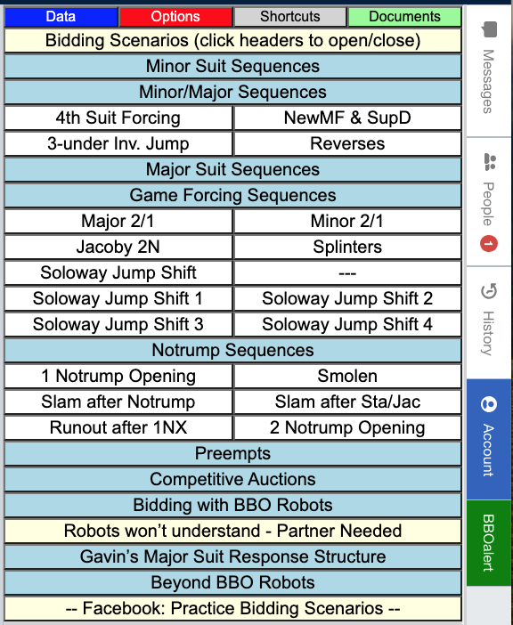
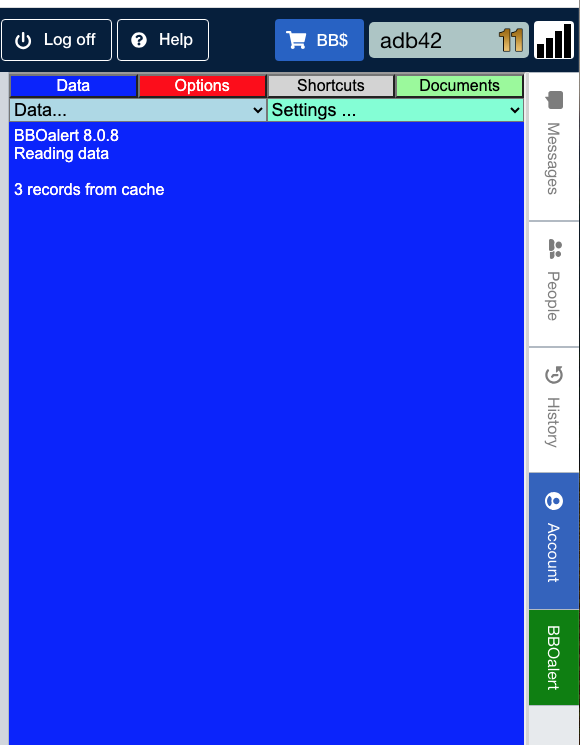
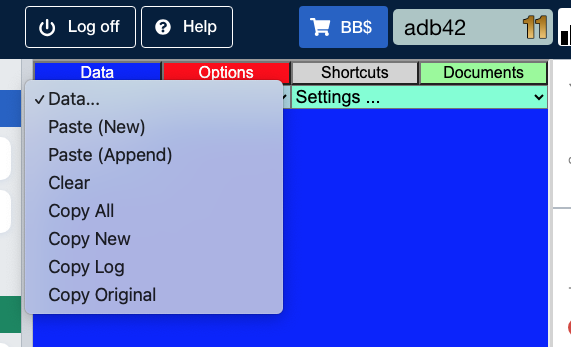
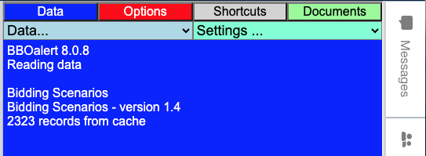
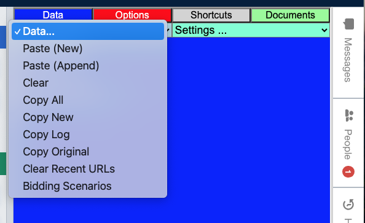

## Better Bidding Practice on BBO

BBO Practice tables are a fantastic resource for bidding practice, either with a partner or with a robot. But to make the most of it one needs to know how to program the deal generator that BBO uses. I have created a new tool called Practice Bidding Scenarios that automates this for you, providing dozens of canned bidding scenarios, for example. Jacoby Transfers, Smolen, slam bidding after a Stayman response, etc. Practice Bidding Scenarios piggybacks on the BBOalert browser extension to create buttons to load the pre-configured dealer code, allowing many bidding scenarios to be selected with just a click.  

  

     
  

 

  

    
  

Each of the buttons with light blue background are section headers.  You may click to expand/collapse the groups of related scenarios.  Clicking a button with a white background will automatically load the dealer constraints for that scenario.
Most of the Scenarios work OK with robots.  Those that don’t, I’ve grouped at the bottom.

I'm excited about the response I’ve received AND, even more so, about this project’s potential. For a while, I struggled with what I wanted from this.  Here’s what I decided:

- I want to make this available as broadly as possible, as soon as possible.  
- I don't want to pursue a trademark, copyright, or patent.
- I don’t want to make money from this.
- I want people to enjoy this.
- I want people to enjoy learning to play better bridge.

_I'm 81 years old; I don’t have time to wait!_

### Installing Practice Bidding Scenarios

I use Google Chrome.  Many common browsers, including Microsoft Edge, are chromium-based. If you use a Chromium-based browser, it's really easy to install and/or remove the BBOalert extension. This one link will let you do either with one click. <a href="(https://chrome.google.com/webstore/detail/bboalert/bjgihidachainhhhilkeemegdhehnlcf)">Click here to install or remove the BBOalert extension</a> on Chrome. If you use a non-chromium browser, you can <a href="(https://github.com/stanmaz/BBOalert/blob/master/README.md#installation)">check here</a> for how to install BBOalert.

At this time, it does not work on IOS devices like iPads and iPhones.  But, if you set up a table on your computer, your partner, using an iPad/iPhone, can join the table and practice bidding with you.

With the extension installed, when you log in to BBO, you'll see a new tab on the right (BBOalert) that will be selected.  (At the top, note the dark blue Data tab with a light blue Data drop-down menu, the gray Shortcuts tab, and on the lower right, the green BBOalert tab.)  The green BBOalert tab, toggles between the BBOalert panel and the usual BBO side panels.

  

You'll need to right-click this <a href="(https://github.com/ADavidBailey/Practice-Bidding-Scenarios/blob/main/-PBS.txt)">Bidding Scenarios</a> link and select the popup menu command "Copy link URL" or "Copy Link Address".  Then, go to the BBOalert Data tab and click the light blue Data/Paste (New) to import the URL into BBOalert.

  

This should be done only once. When you paste the URL, it is saved by BBOalert, and each time you restart BBO, the saved URL is used to re-import the file contents, including any updates; so, you’ll always be up to date.  You'll see something like this each time you start BBO:

  

As scenarios are added or changed, the records read will change.  Each time you start BBO you'll get the latest updates.

And, you'll note that the light blue Data drop-down has changed, too.  At the bottom you'll see the 'Bidding Scenarios' Url has been added to the list.

  

Once you’ve done this, switch to the BBOalert Shortcuts tab and you’ll see the sections and buttons as shown in the initial graphic above.

## Using Practice Bidding Scenarios

The Practice Bidding Scenarios are designed to work at a Practice table.  They do almost nothing if you're not at a practice table.  The one thing they do is create some chat.  Some merely chat the Name of the Scenario.  Others spit out several lines of chat and even links to an article about the convention.  To avoid unintentionally sending chat to the Lobby, the chat is initially directed to you.  If you're practicing with a partner, you should chat to the table.  If you are practicing with a student, you might want to keep the chat private.  It's your choice.

So start your Practice Table.  You may use either a Bidding table or a Teaching table.  I usually use a Bidding table (the Robots are free).  Once you start your Bidding table.  I suggest that to get started, you just watch the robots bid a few hands.  So, put robots in all four seats, open the BBOalert shortcuts tab (the gray one), click on the bidding scenario you want to see, then click Redeal.  The Robots bid a little faster than I do.  So you can fly through a lot hands in a hurry.  Then, switch to another scenario and Redeal to bid a few more.

The scenarios are designed for the user to sit in the south seat.  And, the deals are randomly rotated 180 degrees; so, you'll get to see the scenarios from both opener's and responder's chair.  (This 'randomly rotate' is an option in the Deal source/Advanced; so, you can change it if you want.)

When you're to bid, you should sit in the South seat.  You should seat your partner or a Robot in the North seat.  You may seat Robots in the East/West seats.  Then, open the BBOalert Shortcuts tab and click on a bidding scenario that you want to practice.

When you're seated at the table, you can use the Undo button.  I often like to try a different bidding approach -- this lets you do that.  If you've already clicked Redeal and want to go back to the previous board, you can go the the BBO History, select the board, then click the 'hamburger' (☰) in the upper right, and click Export/Upload deal to table.

## BBO Helper -- Double-Dummy, Par, and Par Contracts

BBO Helper, another browser extension, adds double-dummy, par, and par contracts to your BBO History panel.  This is a significant help in assessing your final contract.  There are a couple of options on how the hands are displayed in the BBO history panel.  It should look like this: 

  

The ‘hamburger’ (☰) in the upper right allows you to toggle between Pictures of Cards and Hand Diagrams -- you want Hand Diagrams; BBO Helper will not insert the double dummy table for Pictures of Cards mode.  NOTE: It starts to work when you finish a hand AND the BBO history panel is open.  Once it's working, you can go back to earlier boards in the history and see it.

Enjoy!

## Postscript
<a href="(https://github.com/ADavidBailey/Practice-Bidding-Scenarios/blob/main/-PBS.txt)">Bidding Scenarios</a>

The <a href="(https://www.facebook.com/groups/598917089100836)">Facebook Group -- Practice Bidding Scenarios</a>, is the place to talk about this, ask your questions, and give me your feedback.   You __DO NOT have to join Facebook__ to use it.  That said, I wish you would.

You may also contact me via email: adavidbailey@gmail.com.  I expect to create more bidding scenarios and, perhaps, incorporate some of yours.

Stanislaw Mazur, the creator of BBOalert, and Matthew Kidd, the creator of BBO Helper, were extremely helpful to me.  I really, really appreciate them.
